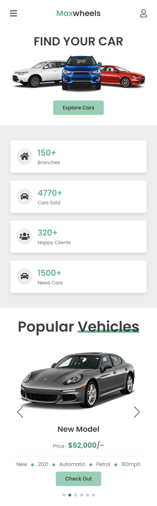

# Cars Landing Page

Este proyecto es una landing page con tematica de carros algo simple, me sirvio principalmente para practicar y entender mejor webpack, antes de pasar a Vite D:  
Tambien para ver como funciona sass junto con la metodologia BEM, implementar un efecto parallax de otra manera y un slider con SwiperJs. Esta vez lo subi a Github Pages, usando github actions, creando un pequeño workflow que crea el build y lo mueve a la rama de gh-pages para el deploy.

## **CAPTURAS**

    
    

<!--
-->
 
 
## **DEMO**

Puede ver el demo de este haciendo click [aquí](https://tono2007.github.io/CarsLandingPage/).

## **TECNOLOGIAS**

Para el proyecto utilice las siguientes tecnologias:

- Webpack
- SASS(SCSS)
- Yarn
- Babel
- Swiper
- HTML, CSS,JS
- Github Pages

## **USO**

Para usar este proyecto:

- Clonar repositorio: ` git clone https://github.com/Tono2007/CarsLandingPage.git`
- Instalar dependencias: `npm install` o` yarn install`
- Ejecutarlo modo desarrollo - Hot Reload: `npm start` o ` yarn start`
- Build Producción `npm run build ` o `yarn build`
- Build Desarrollo `npm run dev ` o `yarn dev`
- Generar Stats `npm run stats ` o `yarn stats`

